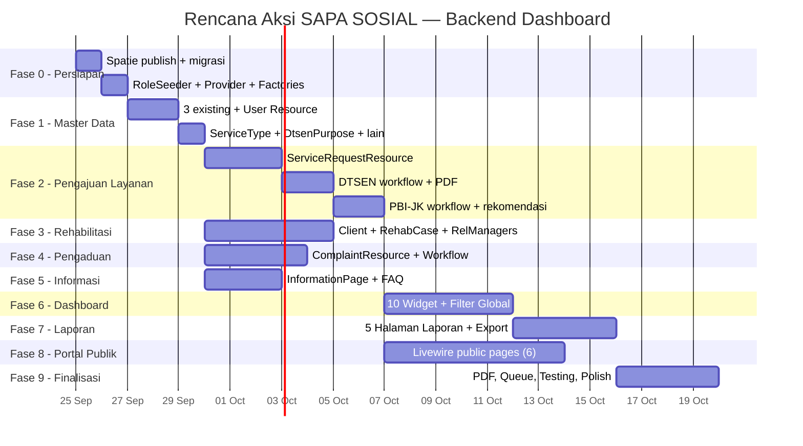

# Rencana Aksi — SAPA SOSIAL Dashboard (Backend)
## Filament v5.8 · Laravel 13 · Livewire v4 · PostgreSQL

---

## Audit Status Proyek (25 September 2026)

| Komponen | Status | Detail |
|----------|--------|--------|
| Migrasi database (33 file) | ✅ Selesai | Semua tabel sesuai PRD Bagian 4 |
| Model Eloquent (30 model) | ✅ Selesai | Relasi, fillable, casts sudah didefinisikan |
| PHP Enum (14 enum) | ✅ Selesai | Status, handler, reason, gender, dll. |
| Seeder master + sample data | ✅ Selesai | `UserSeeder`, `SampleDataSeeder`, dll. |
| `AdminPanelProvider` | ✅ Selesai | Konfigurasi dasar (path `/admin`, login) |
| Filament Resource **PHP files** | ❌ Kosong | Direktori `DistrictResource/`, `VillageResource/`, `WorkUnitResource/` ada tapi **tanpa file PHP** |
| Filament Widgets (Dashboard) | ❌ Belum ada | |
| Filament Custom Pages (Laporan) | ❌ Belum ada | |
| Trait `HasRoles` di User | ❌ Belum ada | Spatie belum dikonfigurasi |
| `LogsActivity` di model kritis | ❌ Belum ada | |
| Policies & Permissions | ❌ Belum ada | |
| Factories (selain `UserFactory`) | ❌ Belum ada | |
| Tests | ❌ Belum ada | |
| Portal Publik (Livewire) | ❌ Belum ada | |

> [!IMPORTANT]
> Semua paket di [`composer.json`](file:///c:/laragon/www/app-layanan/composer.json) sudah terdaftar:
> `filament ^5.8`, `livewire ^4.4`, `spatie/laravel-permission`, `spatie/laravel-activitylog`, `barryvdh/laravel-dompdf`, `simplesoftwareio/simple-qrcode`.
> Pastikan `composer install` dan migrasi Spatie sudah dijalankan sebelum memulai.

---

## Konvensi Teknis Wajib

Baca sebelum menulis kode apapun. Melanggar salah satu akan menyebabkan inkonsistensi arsitektur.

| Aturan | ✅ Benar | ❌ Salah |
|--------|----------|---------|
| Filament v5 Schema API | `$schema->components([...])`, `Filament\Schemas\Schema` | `Form $form`, `HasForms`/`InteractsWithForms` (API v3) |
| Namespace Actions | `Filament\Actions\*` | `Filament\Tables\Actions\*`, `Filament\Forms\Actions\*` |
| Namespace Layout | `Filament\Schemas\Components\Grid`, `Section` | `Filament\Forms\Components\Grid` |
| Icon | `Heroicon::PencilSquare` (enum `Filament\Support\Icons\Heroicon`) | `'heroicon-o-pencil-square'` (string) |
| Kolom status DB | `varchar` (`string()`) + PHP Enum + `label()` Bahasa Indonesia | `enum` native PostgreSQL |
| Repeater | `->schema([...])` | `->fields([...])` |
| DB JSON | `jsonb()` | `json()` |
| DB timestamp | `timestampTz()` | `timestamp()` |
| NIK/KK | `char(16)` | `string`, `bigint` |
| File storage | disk `local` private + temporary signed URL | disk `public` |
| Penomoran tiket | `NumberSequence::generate()` + `lockForUpdate()` dalam transaksi | manual / hardcode |
| `$navigationIcon` | `protected static string \| BackedEnum \| null` | `?string` |
| `$view` (Page/Widget) | `protected string` | `protected static string` |
| BelongsTo field | `Select::make('x_id')->relationship('x', 'name')` | `BelongsToSelect` (tidak ada) |

---

## Fase 0 — Persiapan Infrastruktur

> **Estimasi: 1 hari** · Prioritas: 🔴 P0 · Dependensi: —

### 0.1 — Publish & jalankan migrasi Spatie

```bash
php artisan vendor:publish --provider="Spatie\Permission\PermissionServiceProvider" --no-interaction
php artisan vendor:publish --provider="Spatie\Activitylog\ActivitylogServiceProvider" --no-interaction
php artisan migrate
```

### 0.2 — Konfigurasi [`User.php`](file:///c:/laragon/www/app-layanan/app/Models/User.php)

Saat ini User **belum punya** `HasRoles` dan `LogsActivity`. Tambahkan:

```diff
 use Illuminate\Database\Eloquent\Factories\HasFactory;
 use Illuminate\Foundation\Auth\User as Authenticatable;
 use Illuminate\Notifications\Notifiable;
+use Spatie\Permission\Traits\HasRoles;
+use Spatie\Activitylog\Traits\LogsActivity;
+use Spatie\Activitylog\LogOptions;

 class User extends Authenticatable
 {
-    use HasFactory, Notifiable;
+    use HasFactory, HasRoles, LogsActivity, Notifiable;
+
+    public function getActivitylogOptions(): LogOptions
+    {
+        return LogOptions::defaults()
+            ->logOnly(['name', 'email', 'is_active', 'work_unit_id', 'district_id', 'village_id'])
+            ->logOnlyDirty();
+    }
```

### 0.3 — Buat `RoleAndPermissionSeeder`

File: `database/seeders/RoleAndPermissionSeeder.php`

**Roles:**

| Role (slug) | Deskripsi |
|-------------|-----------|
| `administrator` | Pengelola sistem — akses penuh |
| `petugas_dinsos` | Staf pelayanan & rehabilitasi sosial |
| `pejabat_penandatangan` | Kabid / Kadis — approve SK & rekomendasi |
| `pimpinan` | Kepala Dinas — hanya baca |
| `operator_kecamatan_desa` | Operator wilayah — scope kecamatan/desa |

**Permissions granular:**

```
view_any_{resource}  ·  view_{resource}  ·  create_{resource}
update_{resource}    ·  delete_{resource}  ·  approve_{resource}
```

Resources: `user`, `service_request`, `dtsen_certificate`, `pbi_reactivation`, `rehabilitation_case`, `complaint`, `information_page`, `report`

Assign permissions ke roles sesuai PRD Bagian 1 (matriks peran vs akses).

### 0.4 — Konfigurasi [`AdminPanelProvider.php`](file:///c:/laragon/www/app-layanan/app/Providers/Filament/AdminPanelProvider.php)

Perubahan dari konfigurasi dasar saat ini:

- **Branding:** nama `'SAPA SOSIAL'`, warna primer biru/teal Dinas Sosial (`Color::Teal` atau custom hex)
- `->sidebarCollapsibleOnDesktop()`
- `->navigationGroups([...])` dalam Bahasa Indonesia:
  - "Pengajuan Layanan"
  - "Rehabilitasi Sosial"
  - "Pengaduan Sosial"
  - "Informasi Layanan"
  - "Master Data"
  - "Laporan"
- Daftarkan custom widgets dan pages sesuai kebutuhan

### 0.5 — Buat semua Factories

Buat factory untuk semua model yang belum punya (saat ini hanya `UserFactory` yang ada):

```bash
php artisan make:factory ServiceTypeFactory --model=ServiceType --no-interaction
php artisan make:factory ServiceRequestFactory --model=ServiceRequest --no-interaction
php artisan make:factory DtsenCertificateFactory --model=DtsenCertificate --no-interaction
php artisan make:factory PbiReactivationFactory --model=PbiReactivation --no-interaction
php artisan make:factory ClientFactory --model=Client --no-interaction
php artisan make:factory RehabilitationCaseFactory --model=RehabilitationCase --no-interaction
php artisan make:factory ComplaintFactory --model=Complaint --no-interaction
php artisan make:factory ReferralFactory --model=Referral --no-interaction
php artisan make:factory AssessmentFactory --model=Assessment --no-interaction
php artisan make:factory MonitoringRecordFactory --model=MonitoringRecord --no-interaction
php artisan make:factory InformationPageFactory --model=InformationPage --no-interaction
# ... dst untuk model lainnya
```

---

## Fase 1 — Resources Data Master (Admin)

> **Estimasi: 2–3 hari** · Prioritas: 🔴 P0 · Dependensi: Fase 0

Resources ini hanya diakses Administrator.

> [!WARNING]
> Direktori `DistrictResource/`, `VillageResource/`, `WorkUnitResource/` **ada tapi kosong** (tanpa file PHP). Perlu dibuat ulang atau di-generate isinya.

### 1.1 — `DistrictResource` + `VillageResource` + `WorkUnitResource`

Re-generate ke-3 resource yang sudah ada direktornya tapi kosong:

```bash
php artisan make:filament-resource District --generate --no-interaction
php artisan make:filament-resource Village --generate --no-interaction
php artisan make:filament-resource WorkUnit --generate --no-interaction
```

- **DistrictResource:** kode, nama · Filter: pencarian nama
- **VillageResource:** kode, nama, kecamatan (select) · Filter: kecamatan
- **WorkUnitResource:** nama, toggle aktif

### 1.2 — `UserResource`

```bash
php artisan make:filament-resource User --generate --no-interaction
```

| Aspek | Detail |
|-------|--------|
| **Table** | nama, email, roles (badge via spatie), unit kerja, status aktif (icon), wilayah operator |
| **Form** | nama, email, HP, NIK, password · multi-select roles · select unit kerja · select kecamatan → desa (untuk operator, `live()` cascade) · toggle `is_active` |
| **Filter** | role, unit kerja, status aktif |
| **Bulk action** | aktifkan / nonaktifkan |

### 1.3 — `ServiceTypeResource`

```bash
php artisan make:filament-resource ServiceType --generate --no-interaction
```

- **Form:** kode, nama, kategori, deskripsi, handler (select enum `generic|dtsen|pbi`), `needs_assessment` toggle, `sla_days`, toggle aktif
- **Relation Manager:** `ServiceRequirementsRelationManager`
  - Form: nama persyaratan, wajib/opsional toggle, MIME diizinkan, urutan (`sort_order`)
  - Table: sortable by `sort_order`

### 1.4 — `DtsenPurposeResource`

```bash
php artisan make:filament-resource DtsenPurpose --generate --no-interaction
```

- **Form:** kode, nama, batas desil maks (`1–10`), masa berlaku (hari, nullable), toggle aktif

### 1.5 — `ClientCategoryResource`

```bash
php artisan make:filament-resource ClientCategory --generate --no-interaction
```

- CRUD sederhana: nama kategori

### 1.6 — `ComplaintCategoryResource`

```bash
php artisan make:filament-resource ComplaintCategory --generate --no-interaction
```

- CRUD: nama, toggle aktif

### 1.7 — `ReferralInstitutionResource`

```bash
php artisan make:filament-resource ReferralInstitution --generate --no-interaction
```

- **Form:** nama, tipe (panti/balai/RS/LKS), alamat, kontak, toggle aktif

### 1.8 — Navigation Group

Semua resource di fase ini masuk ke group **"Master Data"** via `$navigationGroup`.

---

## Fase 2 — Modul Pengajuan Layanan (Layanan 1, 2, 4)

> **Estimasi: 6–8 hari** · Prioritas: 🔴 P1 · Dependensi: Fase 1

### 2.1 — `ServiceRequestResource` (Resource Utama)

```bash
php artisan make:filament-resource ServiceRequest --generate --no-interaction
```

**Table:**

| Kolom | Tipe | Catatan |
|-------|------|---------|
| Nomor tiket | TextColumn, searchable | `request_number` |
| Jenis layanan | TextColumn badge | via `serviceType.name` |
| Pemohon | TextColumn, searchable | `applicant_name` |
| NIK | TextColumn | Tersamarkan (***-****-XXXX) |
| Lokasi | TextColumn | `village.name` + `village.district.name` |
| Status | TextColumn badge | Warna per status enum |
| Prioritas | IconColumn | `Heroicon::ExclamationTriangle` jika `is_priority` |
| Petugas | TextColumn | `officer.name` |
| Tanggal masuk | TextColumn | `submitted_at`, sorted desc |

**Search:** nomor tiket, nama pemohon, NIK
**Filter:** jenis layanan, status, kecamatan, desa, prioritas, rentang tanggal
**Bulk action:** assign petugas, export Excel

**Form (Create — petugas/operator):**

```
Section "Jenis Layanan"
  └── Select service_type_id → live() → tampilkan persyaratan dinamis

Section "Data Pemohon"
  └── Grid(2): nama, NIK, No. KK, HP
  └── Grid(3): select kecamatan (live()) → desa (cascade) → textarea alamat

Section "Dokumen Persyaratan" (dinamis per service_type)
  └── Repeater: per requirement → FileUpload + status verifikasi + catatan

Section "Detail DTSEN" (visible jika handler = dtsen)
  └── nama subyek, NIK subyek, hubungan dengan pemohon
  └── Select dtsen_purpose_id, keterangan tujuan

Section "Detail PBI-JK" (visible jika handler = pbi)
  └── nama peserta, NIK peserta, no. BPJS/KIS, tanggal nonaktif
  └── Select alasan (enum) → live()
  └── nama faskes + no. surat faskes (visible jika alasan medis)
```

**Infolist (View):**
- Data pemohon, dokumen (download link), status (badge), timeline status (dari `status_histories`), catatan petugas, detail DTSEN/PBI, riwayat persetujuan

### 2.2 — Status Workflow Actions

Setiap transisi = `Action` di header page atau table row action:

```
submitted        → document_check      : "Terima & Periksa Berkas" (assign officer_id)
document_check   → revision_requested  : "Minta Perbaikan" (wajib isi catatan)
revision_requested → submitted         : "Kirim Ulang" (pemohon/operator)
document_check   → data_verification   : "Berkas Lengkap" (semua dokumen status = valid)
data_verification → awaiting_approval  : "Ajukan ke Pejabat" (DTSEN: cek SIKS-NG sudah diisi)
awaiting_approval → issued             : "Setujui & Terbitkan" (pejabat only, generate PDF+QR)
issued           → completed           : "Selesai"
*                → rejected            : "Tolak" (wajib isi alasan)
```

> [!IMPORTANT]
> Setiap transisi **wajib** menulis ke `status_histories` (via trait `HasStatusHistory` atau observer). Validasi transisi di dalam Action `->action()` closure. Gunakan `Filament\Actions\Action` (bukan sub-namespace).

### 2.3 — `DtsenCertificate` Management

- Custom section di `ViewServiceRequest` atau custom page `ManageDtsenCertificate`
- **Form cek SIKS-NG:** toggle `is_registered`, desil (select `1–10`), `checked_at`, `checker_id` (auto dari auth)
- **Validasi bisnis:**
  - Desil ≤ `dtsen_purposes.max_decile` → jika tidak, peringatan + force `rejected`
  - Warning duplikasi: cek `dtsen_certificates` aktif sama pemohon + tujuan → notifikasi petugas
- **Generate PDF:** dispatch job `GenerateDtsenCertificatePdf` ke queue
  - Template Blade + `dompdf` + QR code (`simplesoftwareio/simple-qrcode`)
  - QR menuju `/verifikasi/{verification_code}`
- **Nomor surat:** `NumberSequence::generate('DTSEN')` dalam DB transaction + `lockForUpdate()`

### 2.4 — `PbiReactivation` Management

- Custom section di `ViewServiceRequest` atau custom page
- Action khusus per tahap:
  - `eligibility_verification`: form desil & hasil verifikasi kelayakan
  - `awaiting_approval → recommendation_issued`: generate surat rekomendasi PDF
  - `proposed_to_ministry`: catat tanggal input SIKS-NG (wajib)
  - `ministry_approved / ministry_rejected`: catat keputusan & tanggal
  - `reactivated`: catat tanggal aktif kembali di BPJS (wajib)
- **Prioritas darurat medis:** auto-set `is_priority = true` saat reason = `emergency`; badge merah
- **Warning SLA:** kasus > X hari di `proposed_to_ministry` → ditandai di dashboard

### 2.5 — `ApprovalsRelationManager`

- Tampilkan riwayat paraf/persetujuan berjenjang (step 1: Kabid, step 2: Kadis)
- Action: "Setujui" / "Kembalikan" — **hanya** user dengan role `pejabat_penandatangan`
- Setiap keputusan: `approver_id`, `decision`, `notes`, `decided_at`

### 2.6 — `ServiceRequestDocumentsRelationManager`

- Table: nama persyaratan, file (download link), status verifikasi (badge), catatan
- Action per baris: "Tandai Valid" / "Perlu Perbaikan" (isi catatan)

### 2.7 — `ServiceRequestPolicy`

```bash
php artisan make:policy ServiceRequestPolicy --model=ServiceRequest --no-interaction
```

| Method | Akses |
|--------|-------|
| `viewAny` | Semua role internal |
| `view` | Petugas assigned, operator wilayahnya, admin, pimpinan |
| `create` | Petugas, operator, admin |
| `update` | Petugas assigned, admin |
| `delete` | Admin only |
| `approve` | Pejabat penandatangan |

Override `getEloquentQuery()` di Resource: scope operator ke `district_id`/`village_id` miliknya.

---

## Fase 3 — Modul Rehabilitasi Sosial (Layanan 3)

> **Estimasi: 4–5 hari** · Prioritas: 🟡 P1 · Dependensi: Fase 1

### 3.1 — `ClientResource`

```bash
php artisan make:filament-resource Client --generate --no-interaction
```

- **Form:** nama, kategori klien (select), NIK (nullable), tanggal lahir, gender (enum), alamat, kecamatan→desa (cascade), HP
- **Scope akses:** data sensitif → hanya petugas rehabilitasi yang ditugaskan + admin
- **Relation Manager:** `RehabilitationCasesRelationManager` (ringkasan kasus)

### 3.2 — `RehabilitationCaseResource`

```bash
php artisan make:filament-resource RehabilitationCase --generate --no-interaction
```

**Table:**
- Nomor kasus, klien (nama+kategori), petugas, status (badge), jenis penanganan, sumber (link ke pengajuan/pengaduan), tanggal masuk

**Form:**
- Select klien (dengan `CreateAction` inline), sumber (`service_request_id` nullable / `complaint_id` nullable), `handling_type` (direct/referral/both), `officer_id`

**Relation Managers:**

| Relation Manager | Detail |
|-----------------|--------|
| `AssessmentsRelationManager` | CRUD assessment per kasus: tanggal, petugas, hasil, kebutuhan pelayanan, rekomendasi, `needs_referral` toggle |
| `ReferralsRelationManager` | CRUD rujukan — **hanya tampil jika** `assessment.needs_referral = true` |
| `MonitoringRecordsRelationManager` | CRUD: tanggal, petugas, perkembangan, catatan hasil |

### 3.3 — Status Workflow Actions (Kasus)

| Transisi | Validasi |
|----------|----------|
| `received → assessment` | — |
| `assessment → service_planning` | Minimal 1 assessment tercatat |
| `service_planning → in_service` | Rekomendasi ada di assessment |
| `in_service → monitoring` | — |
| `monitoring → closed` | Wajib isi `handling_result` |

### 3.4 — Status Workflow Actions (Rujukan)

| Transisi | Validasi |
|----------|----------|
| `draft → sent` | Institution & officer wajib ada |
| `sent → accepted` | — |
| `accepted → in_service` | — |
| `in_service → completed` | Wajib isi `service_result` |
| `* → declined / cancelled` | Wajib isi alasan |

### 3.5 — `RehabilitationCasePolicy`

- Data klien = sensitif → scope ke `officer_id` yang ditugaskan
- Pimpinan hanya ringkasan (dashboard widget), bukan detail identitas klien

---

## Fase 4 — Modul Pengaduan Sosial (Layanan 5)

> **Estimasi: 3–4 hari** · Prioritas: 🟡 P2 · Dependensi: Fase 1

### 4.1 — `ComplaintResource`

```bash
php artisan make:filament-resource Complaint --generate --no-interaction
```

**Table:** nomor laporan, kategori, pelapor, lokasi (desa+kecamatan), status (badge), petugas, tanggal
**Filter:** kategori, status, kecamatan, desa, rentang tanggal
**Search:** nomor laporan, nama pelapor, HP

**Form:**
- Data pelapor: nama, HP
- Kategori pengaduan (select), kecamatan→desa (cascade), detail lokasi
- Deskripsi permasalahan (textarea)
- Upload lampiran (multiple: foto/dokumen)

**Relation Managers:**
- `ComplaintAttachmentsRelationManager`: list lampiran + download
- `DispositionsRelationManager`: polimorfik — dipakai juga di ServiceRequest & RehabilitationCase

### 4.2 — Status Workflow Actions

| Transisi | Validasi |
|----------|----------|
| `received → verification` | — |
| `verification → clarification_requested` | Wajib isi catatan |
| `clarification_requested → verification` | — |
| `verification → dispatched` | Disposisi ke unit/petugas wajib dibuat |
| `dispatched → in_handling` | — |
| `in_handling → resolved` | Wajib isi `action_taken` |
| `* → duplicate` | Pilih laporan induk (`duplicate_of_id`) |
| `* → invalid` | Wajib isi alasan |

### 4.3 — Action: "Buat Kasus Rehabilitasi"

- Action di header `ViewComplaint`
- Buat `RehabilitationCase` baru → set `complaint_id`
- Redirect ke halaman kasus baru

---

## Fase 5 — Modul Informasi Layanan (Layanan 6)

> **Estimasi: 2–3 hari** · Prioritas: 🟢 P2 · Dependensi: Fase 1

### 5.1 — `InformationPageResource`

```bash
php artisan make:filament-resource InformationPage --generate --no-interaction
```

**Form:**
- Judul → slug (auto-generate via `live(onBlur: true)` + `afterStateUpdated` → `Str::slug`)
- Kategori (enum: program/rehabilitation/disability/elderly/complaint/other)
- Select `service_type_id` (nullable)
- Rich editor: deskripsi, persyaratan, prosedur
- Jam layanan, lokasi, kontak
- Status publikasi (draft/published/archived)
- Select `manager_id` (auto dari auth)

**Relation Managers:**

| RM | Detail |
|----|--------|
| `DownloadableFormsRelationManager` | Upload formulir, versi, `is_current` toggle |
| `FaqsRelationManager` | CRUD FAQ, sortable (`sort_order`) |

### 5.2 — Standalone `FaqResource` (opsional)

FAQ tanpa halaman induk (`information_page_id` nullable). Berguna untuk FAQ umum lintas layanan.

---

## Fase 6 — Dashboard & Widget

> **Estimasi: 4–5 hari** · Prioritas: 🟡 P1 · Dependensi: Fase 2, 3, 4

### 6.1 — Custom Dashboard Widgets

Semua di `app/Filament/Widgets/`. Menerima filter global (periode, jenis layanan, kecamatan, desa).

| Widget Class | Tipe | Data yang Ditampilkan |
|-------------|------|-----------------------|
| `DtsenIssuedStatsWidget` | StatsOverviewWidget | SK terbit periode terpilih, per tujuan, per desil |
| `DtsenPendingApprovalWidget` | TableWidget | Antrean menunggu tanda tangan pejabat |
| `PbiStatusOverviewWidget` | StatsOverviewWidget | Jumlah per status: verifikasi, Kemensos, aktif, ditolak |
| `PbiMedicalEmergencyWidget` | TableWidget | Darurat medis belum selesai (prioritas) |
| `PbiStaleProposalsWidget` | TableWidget | Tertahan > X hari di `proposed_to_ministry` |
| `RehabActiveCasesWidget` | StatsOverviewWidget | Kasus aktif per status |
| `ReferralByInstitutionWidget` | TableWidget | Rujukan aktif per lembaga tujuan |
| `IncomingRequestsChartWidget` | ChartWidget | Pengajuan & pengaduan per periode (line chart) |
| `ProcessingVsCompletedWidget` | ChartWidget | Dalam proses vs selesai (donut chart) |
| `RegionalDistributionWidget` | TableWidget | Sebaran per kecamatan/desa |

### 6.2 — Scoping Widget per Role

| Role | Scope Data |
|------|-----------|
| Operator Kecamatan/Desa | Hanya `district_id`/`village_id` miliknya |
| Pimpinan | Semua data, read-only |
| Petugas Dinsos | Data yang di-assign + statistik global |
| Administrator | Semua data |

### 6.3 — Filter Global Dashboard

Custom dashboard page atau komponen filter bersama:
- Periode (date range: mulai – sampai)
- Jenis layanan (multi-select)
- Status (multi-select)
- Kecamatan → Desa (cascade select)

Widget menerima filter via shared state atau query string.

---

## Fase 7 — Halaman Laporan Berkala

> **Estimasi: 3–4 hari** · Prioritas: 🟡 P1 · Dependensi: Fase 2, 3, 4

### 7.1 — Custom Filament Pages

```bash
php artisan make:filament-page Reports/RekapDtsenReport --no-interaction
php artisan make:filament-page Reports/RekapPbiReport --no-interaction
php artisan make:filament-page Reports/RehabilitasiReport --no-interaction
php artisan make:filament-page Reports/PelayananReport --no-interaction
php artisan make:filament-page Reports/PengaduanReport --no-interaction
```

Navigation group: **"Laporan"**

### 7.2 — Struktur Setiap Halaman Laporan

| Elemen | Detail |
|--------|--------|
| **Filter** | Schema form: periode (date range), kategori/jenis layanan, wilayah (kecamatan→desa) |
| **Tabel** | Filament Table dengan data hasil filter |
| **Export** | Header action: Export Excel + Export PDF |
| **Queue** | Ekspor besar → dispatch `ExportReportJob` via Laravel Queue (driver `database`) |

### 7.3 — Detail per Laporan

| Laporan | Isi |
|---------|-----|
| **Rekap SK DTSEN** | Jumlah surat terbit & ditolak, per tujuan penggunaan, desil, kecamatan/desa |
| **Rekap Reaktivasi PBI-JK** | Jumlah per alasan, status, keputusan Kemensos, lama proses rata-rata, per wilayah |
| **Rehabilitasi Sosial** | Jumlah kasus & rujukan, kategori klien, lembaga tujuan, status, hasil penanganan |
| **Pelayanan (semua jenis)** | Jumlah pengajuan per jenis, status, periode, wilayah |
| **Pengaduan** | Jumlah per kategori, status, kecamatan/desa, periode |

---

## Fase 8 — Portal Publik (Livewire v4)

> **Estimasi: 5–7 hari** · Prioritas: 🟢 P3 · Dependensi: Fase 2, 4, 5

### 8.1 — Layout & Desain

- Livewire v4 full-page components + Tailwind CSS v4
- Layout: `resources/views/layouts/public.blade.php`
- Header: logo Dinsos, navigasi (Layanan, Pengaduan, Cek Status, Informasi)
- Mobile-first responsive
- **Gunakan `HasSchemas` + `InteractsWithSchemas`** (Filament v5 API), BUKAN `HasForms`/`InteractsWithForms`

### 8.2 — Halaman yang Dibangun

| Halaman | Livewire Component | Detail |
|---------|-------------------|--------|
| Informasi Layanan (list) | `App\Livewire\Public\InformationIndex` | List `published`, pencarian → log ke `search_logs` |
| Informasi Layanan (detail) | `App\Livewire\Public\InformationDetail` | Detail + download formulir + FAQ |
| Form Pengajuan Layanan | `App\Livewire\Public\ServiceRequestForm` | Wizard: pilih layanan → data pemohon → dokumen → konfirmasi → tiket |
| Form Pengaduan Sosial | `App\Livewire\Public\ComplaintForm` | Kategori → data pelapor → lokasi → deskripsi → lampiran → tiket |
| Cek Status Tiket | `App\Livewire\Public\TicketStatus` | Input: nomor tiket + 4 digit NIK/HP → timeline status |
| Verifikasi SK DTSEN | `App\Livewire\Public\VerifyDtsenCertificate` | Route: `GET /verifikasi/{code}` → nama, NIK tersamarkan, tujuan, tanggal, masa berlaku, status |

---

## Fase 9 — Finalisasi & Quality Assurance

> **Estimasi: 3–4 hari** · Prioritas: 🟢 P3 · Dependensi: Semua fase

### 9.1 — Generate PDF & QR Code

- **SK DTSEN:** template Blade + `dompdf` + QR (`simplesoftwareio/simple-qrcode`)
- **Surat Rekomendasi PBI-JK:** template Blade + `dompdf`
- **Nomor surat:** `NumberSequence::generate($prefix)` dalam DB transaction + `lockForUpdate()`
- PDF generation → dispatch ke Queue agar tidak blokir request

### 9.2 — Queue & Scheduled Tasks

```php
// routes/console.php
Schedule::job(new MarkStalePbiProposals)->daily();
Schedule::job(new MarkStaleServiceRequests)->daily();
```

| Job | Tipe |
|-----|------|
| `GenerateDtsenCertificatePdf` | Queue (database driver) |
| `GeneratePbiRecommendationPdf` | Queue |
| `ExportReportJob` | Queue |
| `MarkStalePbiProposals` | Scheduled daily |
| `MarkStaleServiceRequests` | Scheduled daily |

### 9.3 — Activity Log pada Model Kritis

Tambahkan `LogsActivity` + `getActivitylogOptions()` pada:
- `ServiceRequest`, `DtsenCertificate`, `PbiReactivation`
- `RehabilitationCase`, `Referral`
- `Complaint`, `Approval`

### 9.4 — File Storage & Security

- Disk `local` private untuk semua dokumen pribadi
- Akses via `Storage::temporaryUrl($path, now()->addMinutes(15))`
- Validasi MIME type pada setiap upload
- NIK/KK: tampilkan tersamarkan di infolist/table (`***-****-XXXX`)

### 9.5 — Testing

```bash
# Feature tests per resource
php artisan make:test ServiceRequestResourceTest --phpunit --no-interaction
php artisan make:test DtsenCertificateWorkflowTest --phpunit --no-interaction
php artisan make:test PbiReactivationWorkflowTest --phpunit --no-interaction
php artisan make:test ComplaintWorkflowTest --phpunit --no-interaction
php artisan make:test RehabilitationCaseWorkflowTest --phpunit --no-interaction
# Unit tests
php artisan make:test NumberSequenceTest --unit --phpunit --no-interaction
php artisan make:test StatusTransitionTest --unit --phpunit --no-interaction
```

> [!IMPORTANT]
> Jalankan test terhadap **PostgreSQL** (bukan SQLite). Set `DB_CONNECTION=pgsql` di `phpunit.xml`.

### 9.6 — Code Quality

```bash
vendor/bin/pint --dirty --format agent
```

Jalankan setelah setiap perubahan PHP sebelum commit.

---

## Timeline & Gantt Chart



> [!NOTE]
> Fase 2, 3, 4, 5 dapat dikerjakan **paralel** setelah Fase 1 selesai.
> **Total estimasi:** ~6 minggu sequential, **~3–4 minggu jika paralel**.

---

## Checklist Prioritas Eksekusi

| Prioritas | Fase | Status | Keterangan |
|-----------|------|--------|------------|
| 🔴 P0 | 0 — Persiapan Infrastruktur | ⬜ Belum | Fondasi semua fase |
| 🔴 P0 | 1 — Data Master Resources | ⬜ Belum | 3 direktori ada tapi kosong, semua perlu dibuat |
| 🔴 P1 | 2 — Pengajuan (DTSEN + PBI-JK) | ⬜ Belum | Layanan prioritas utama ⭐ |
| 🟡 P1 | 3 — Rehabilitasi Sosial | ⬜ Belum | Layanan prioritas ⭐ |
| 🟡 P1 | 6 — Dashboard Widget | ⬜ Belum | Kebutuhan pimpinan |
| 🟡 P1 | 7 — Halaman Laporan | ⬜ Belum | Export Excel/PDF |
| 🟡 P2 | 4 — Pengaduan Sosial | ⬜ Belum | Relatif lebih sederhana |
| 🟢 P2 | 5 — Informasi Layanan | ⬜ Belum | Konten publik |
| 🟢 P3 | 8 — Portal Publik | ⬜ Belum | Akses masyarakat |
| 🟢 P3 | 9 — Finalisasi & QA | ⬜ Belum | Go-live readiness |
